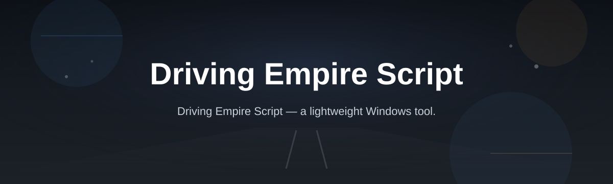
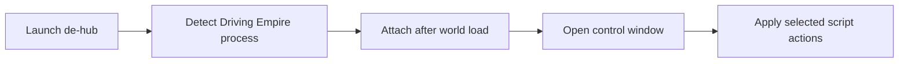

# de-hub

*A cleaner way to run a Driving Empire script without wrestling with executor setup every session.*

## What this is

de-hub started as a weekend project after one too many nights spent trying to get a stable Driving Empire script running through executors that either lagged the moment traffic loaded in or dropped the UI entirely after a game update. What began as a single-file utility for personal use grew into something worth packaging properly — a standalone Windows tool built specifically around how Driving Empire behaves: its car spawning, its economy loop, its map streaming quirks.

This repo hosts the source and documentation for that tool. It is not a general-purpose executor and it does not try to be. Every part of de-hub is built to work with Driving Empire's actual client behavior, which is why it stays lighter and more predictable than multi-game frameworks that treat every Roblox title the same way.

  

The button above opens the project's landing page, where the current build is available to download.

## Who it is for

- Players who want a Driving Empire script that survives client updates without daily patch-chasing
- People who tried an executor once, got a crash on startup, and gave up
- Anyone grinding cash/rep in Driving Empire who wants fewer manual clicks during repetitive stretches
- Server owners testing how their custom maps or configs interact with common scripts before opening to the public
- Developers curious how a small, focused Roblox tool is structured end to end

## What you can do

- **Launch straight into Driving Empire** without configuring a generic executor first
- **Run automation loops** for repetitive tasks like deliveries or lap grinding
- **Adjust car-handling tweaks** that respect the game's physics instead of fighting them
- **Toggle UI overlays** showing live stats without cluttering the default HUD
- **Save your own presets** so settings persist between sessions
- **Recover gracefully** from most in-game reconnects without a full relaunch
- **Check for script updates** on startup so you're not running a stale build
- **Read plain-language logs** if something fails, instead of a raw stack trace

## Getting started

1. Open the landing page using the download button on this page.
2. Download the latest de-hub build listed there.
3. Extract the folder if it arrives zipped — no installer is required.
4. Run the executable directly; Windows may ask for a SmartScreen confirmation on first launch.
5. Load Driving Empire, then attach de-hub from its window before starting a session.

## Requirements

- Windows 10 or Windows 11 (64-bit)
- No Visual Studio, Node, or Python toolchain needed
- No account sign-up inside the tool itself
- Roblox and Driving Empire installed and able to launch normally on your machine

## How it works

de-hub is intentionally simple under the hood. It watches for the Driving Empire process, attaches once the game world has loaded, and exposes a small control window instead of injecting a broad framework.

1. You start de-hub before or after opening Roblox — order doesn't matter.
2. It waits quietly until Driving Empire's map has finished streaming in.
3. Once attached, the control window unlocks the available actions.
4. Any preset you saved loads automatically at this point.
5. From there, toggles and automations run live, updating as the game state changes.

## FAQ

**Is this a Driving Empire script or a full executor?**
It's a script tool built for one game. It doesn't try to run arbitrary Lua for other Roblox titles.

**Will it work after Driving Empire updates?**
Most minor updates don't break it, since it targets stable game systems rather than memory offsets that shift often. Larger overhauls may need a short-turnaround update, which is posted on the landing page.

**Does it work on Mac or mobile?**
No. The current build is Windows-only. There's no macOS or mobile version planned right now.

**Can I use my own settings across sessions?**
Yes — presets save locally and reload automatically the next time you attach.

**Why does Windows show a warning when I open it?**
SmartScreen flags most unsigned indie tools by default. It's a standard warning for small, independently built software, not an error in the build itself.

## Troubleshooting

- **de-hub won't attach to Driving Empire** — Make sure the game has fully loaded into a map before opening the control window; attaching too early can silently fail.
- **Control window opens but toggles do nothing** — Confirm you're on the latest download from the landing page; older builds sometimes lose sync with current game state names.
- **Windows blocks the executable outright** — Check that antivirus real-time protection isn't quarantining it on extraction; this happens with some default Defender configurations.
- **Presets don't reload** — Verify the tool has write access to its own folder; running from a restricted directory can prevent settings from saving.

## License

Released under the [MIT License](LICENSE). de-hub is provided as-is, with no warranty of any kind, and is not affiliated with or endorsed by Roblox Corporation or the developers of Driving Empire.

  

